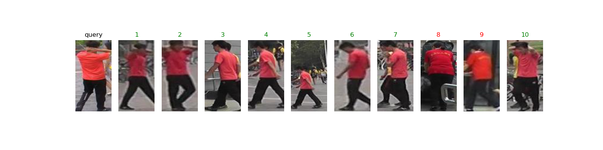

PersonReID: Given a query image captured by camera A, we need to find images of this person from other cameras. The core of person re-identification is how to find discriminative pedestrian features.

Result:

### Steps:
1. Prepare dataset(public person ReID dataset `Market1501`, `prepare.py`)
2. Build Neural Network (`model.py`)
3. Train (`train.py`)
4. Test (`test.py`)
5. Evaluate (`evaluate.py`)

### Reference
[1] Person_reID_baseline_pytorch Model: https://github.com/layumi/Person_reID_baseline_pytorch
[2] Deng, Jia, Wei Dong, Richard Socher, Li-Jia Li, Kai Li, and Li Fei-Fei. "Imagenet: A large-scale hierarchical image database." In Computer Vision and Pattern Recognition, 2009. CVPR 2009. IEEE Conference on, pp. 248-255. Ieee, 2009.